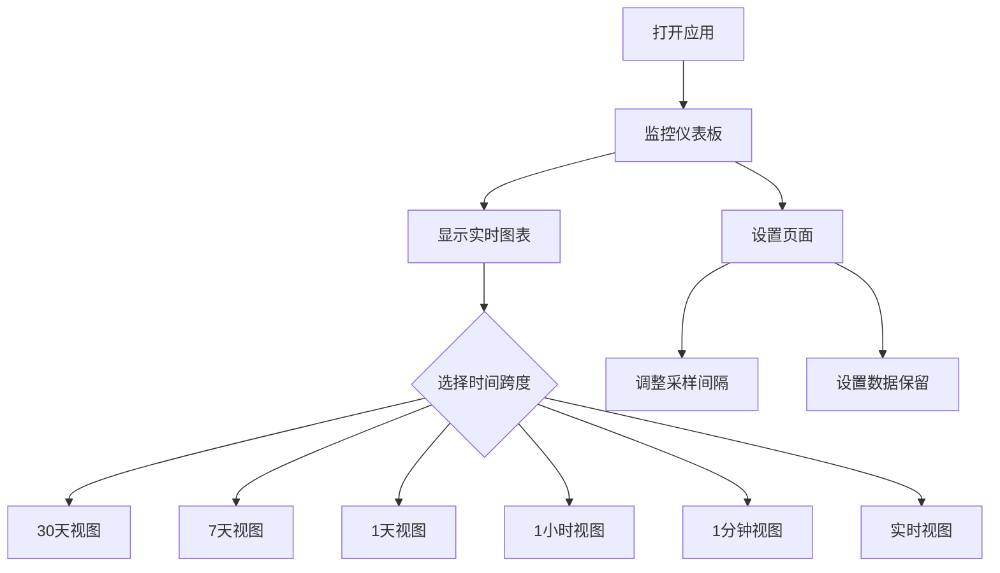

## 1. 产品概述
Linux系统监控应用是一个实时性能监控工具，用于收集和可视化Linux系统的CPU、内存、带宽和IO使用情况。帮助系统管理员和开发者实时了解系统运行状态，快速发现性能瓶颈。

目标用户：Linux系统管理员、开发者、运维人员，需要监控系统性能的技术人员。

## 2. 核心功能

### 2.1 用户角色
本产品为单用户工具应用，无需用户注册和权限管理。

### 2.2 功能模块
系统监控应用包含以下核心页面：
1. **监控仪表板**：实时显示四个指标的折线图，时间跨度选择器。
2. **设置页面**：配置数据刷新间隔、历史数据保留时间。

### 2.3 页面详情

| 页面名称 | 模块名称 | 功能描述 |
|---------|---------|----------|
| 监控仪表板 | 指标图表区 | 显示CPU使用率折线图，支持实时更新，可切换时间跨度（30天、7天、1天、1小时、1分钟、实时） |
| 监控仪表板 | 指标图表区 | 显示内存使用率折线图，支持实时更新，可切换时间跨度 |
| 监控仪表板 | 指标图表区 | 显示带宽使用率折线图，支持实时更新，可切换时间跨度 |
| 监控仪表板 | 指标图表区 | 显示IO使用率折线图，支持实时更新，可切换时间跨度 |
| 监控仪表板 | 时间控制栏 | 提供时间跨度选择按钮，快速切换数据显示范围 |
| 监控仪表板 | 状态指示器 | 显示数据连接状态、最后更新时间 |
| 设置页面 | 基本设置 | 配置数据采样间隔（1秒-60秒可调） |
| 设置页面 | 数据管理 | 设置历史数据保留时间（7天-90天可调），手动清理旧数据 |

## 3. 核心流程

用户操作流程：
1. 用户打开应用，自动进入监控仪表板页面
2. 系统默认显示实时数据（1秒刷新）的四个指标图表
3. 用户可通过顶部时间选择器切换不同时间跨度
4. 图表自动更新显示对应时间范围内的历史数据
5. 用户可进入设置页面调整采样频率和数据保留策略

## 4. 用户界面设计

### 4.1 设计风格
- **主色调**：深灰色背景（#1a1a1a）搭配蓝色 accent（#3b82f6）
- **辅助色**：绿色表示正常（#10b981），橙色表示警告（#f59e0b），红色表示危险（#ef4444）
- **按钮样式**：圆角矩形，扁平化设计，hover时有轻微阴影效果
- **字体**：Inter 字体家族，标题 18-24px，正文 14px，小标签 12px
- **布局风格**：卡片式布局，深色主题，适合长时间监控使用
- **图标风格**：使用简约的线性图标，保持一致的线条粗细

### 4.2 页面设计概览

| 页面名称 | 模块名称 | UI元素 |
|---------|---------|--------|
| 监控仪表板 | 顶部导航栏 | 深色背景，左侧应用标题，右侧设置按钮，高度60px |
| 监控仪表板 | 时间选择器 | 圆角按钮组，选中状态高亮显示，间距8px |
| 监控仪表板 | 图表容器 | 白色卡片背景，圆角8px，内边距16px，阴影效果，每个图表高度300px |
| 监控仪表板 | 图表标题 | 14px粗体，显示指标名称和当前值，位于图表上方 |
| 监控仪表板 | 折线图 | 网格线淡化显示，数据线宽2px，包含数据点，支持tooltip显示具体时间数值 |
| 监控仪表板 | 状态栏 | 底部显示连接状态、最后更新时间和数据点数量 |
| 设置页面 | 设置表单 | 卡片式布局，包含输入框和滑块控件，标签清晰对齐 |

### 4.3 响应式设计
- **桌面优先**：默认针对1920x1080分辨率优化
- **移动端适配**：支持平板和手机查看，图表在小屏幕下垂直排列
- **触摸优化**：按钮最小点击区域44x44px，支持触摸滑动操作

### 4.4 性能考虑
- **图表渲染**：使用Canvas或SVG渲染，确保流畅的动画效果
- **数据加载**：采用分页加载策略，避免一次性加载大量历史数据
- **实时更新**：WebSocket或轮询机制，确保数据实时性