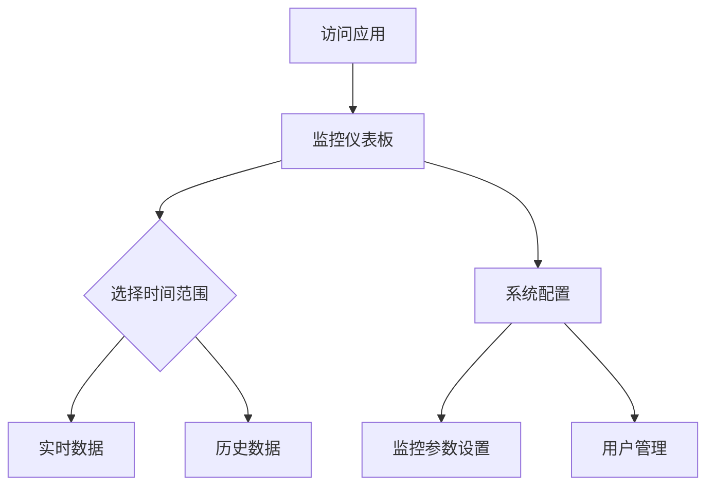

## 1. 产品概述
服务器监控应用是一个实时监控系统资源使用情况的Web应用。通过可视化图表展示CPU、内存、网络流量和磁盘I/O等关键指标，帮助系统管理员快速了解服务器运行状态。

目标用户为需要监控服务器性能的运维人员和技术管理员，提供直观的数据展示和历史趋势分析功能。

## 2. 核心功能

### 2.1 用户角色
| 角色 | 注册方法 | 核心权限 |
|------|----------|----------|
| 管理员 | 系统预设 | 查看所有监控数据、配置监控参数、导出历史数据 |
| 访客用户 | 无需注册 | 查看实时监控数据、切换时间范围 |

### 2.2 功能模块
服务器监控应用包含以下主要页面：
1. **监控仪表板**: 实时数据展示、时间范围选择、图表切换
2. **历史数据页面**: 数据趋势分析、导出功能、详细统计
3. **系统配置页面**: 监控参数设置、告警配置、用户管理

### 2.3 页面详情
| 页面名称 | 模块名称 | 功能描述 |
|----------|----------|----------|
| 监控仪表板 | 实时图表区域 | 显示CPU使用率、内存使用率、网络流量、磁盘I/O的实时折线图，支持自动刷新 |
| 监控仪表板 | 时间选择器 | 提供实时、1小时、1天、7天、30天时间范围切换功能 |
| 监控仪表板 | 数据概览卡片 | 显示当前各项指标的数值和状态指示器 |
| 历史数据页面 | 趋势图表 | 展示选定时间范围内的历史数据变化趋势 |
| 历史数据页面 | 数据导出 | 支持将历史数据导出为CSV或JSON格式 |
| 系统配置页面 | 监控设置 | 配置数据采集间隔、告警阈值等参数 |
| 系统配置页面 | 用户管理 | 添加、删除用户，设置用户权限 |

## 3. 核心流程
用户访问监控应用后，首先进入监控仪表板页面查看实时数据。可以通过时间选择器切换不同的时间范围查看历史趋势。管理员用户可以进入系统配置页面进行参数设置。

## 4. 用户界面设计

### 4.1 设计风格
- **主色调**: 深蓝色 (#1e40af) 作为主品牌色，绿色 (#10b981) 表示正常状态，红色 (#ef4444) 表示告警
- **按钮样式**: 圆角矩形设计，主要操作为实心填充，次要操作为边框样式
- **字体**: 使用系统默认字体，标题16-18px，正文14px，小字12px
- **布局风格**: 卡片式布局，顶部导航栏，主要内容区域采用网格系统
- **图标风格**: 使用简洁的线性图标，状态指示采用彩色圆点

### 4.2 页面设计概述
| 页面名称 | 模块名称 | UI元素 |
|----------|----------|--------|
| 监控仪表板 | 顶部导航 | 深蓝色背景，白色文字，包含应用标题和用户菜单 |
| 监控仪表板 | 图表区域 | 白色卡片背景，每个指标单独卡片，折线图使用不同颜色区分 |
| 监控仪表板 | 控制面板 | 时间选择器采用下拉菜单样式，按钮使用圆角设计 |
| 历史数据页面 | 时间轴 | 横向时间轴显示，支持拖拽选择时间范围 |
| 系统配置页面 | 设置表单 | 分组显示配置项，使用开关组件和输入框 |

### 4.3 响应式设计
采用桌面优先设计，主界面针对1920x1080分辨率优化。在平板设备上采用自适应布局，手机端提供简化版本的监控界面。支持触摸操作，图表支持手势缩放。

### 4.4 数据可视化
- 图表类型: 使用折线图展示时间序列数据
- 颜色编码: CPU(蓝色)、内存(绿色)、网络(橙色)、磁盘(紫色)
- 交互功能: 鼠标悬停显示具体数值，点击图例切换显示/隐藏对应指标
- 更新动画: 数据更新时采用平滑过渡动画效果