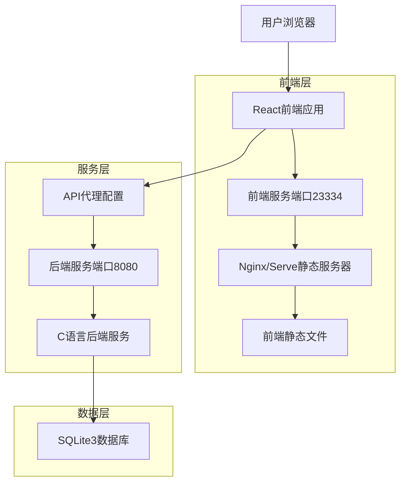
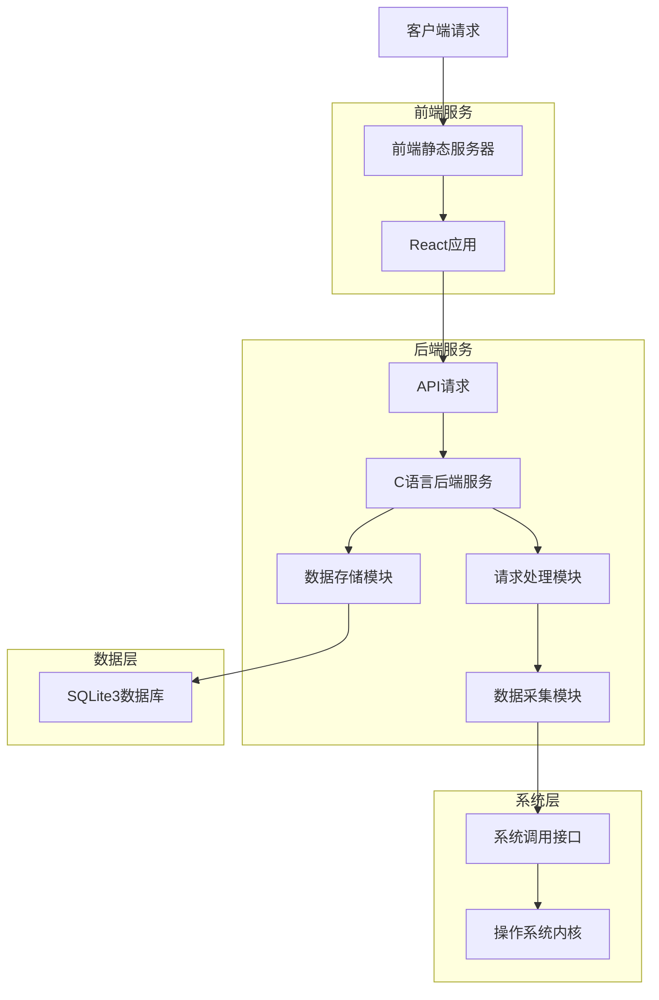
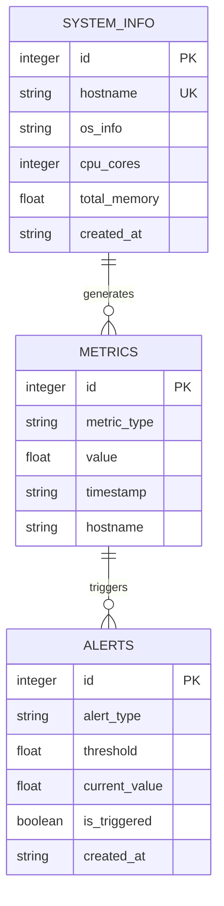

## 1. 架构设计



## 2. 技术描述

- **前端**: React@18 + TypeScript + Vite + TailwindCSS
- **构建工具**: Vite-init
- **后端**: C语言服务（自定义HTTP服务器）
- **数据库**: SQLite3
- **部署**: Systemd服务管理 + Linux环境
- **代理**: Vite开发代理配置

## 3. 路由定义

| 路由 | 用途 |
|------|------|
| / | 监控仪表板主页，显示实时数据 |
| /history | 历史数据页面，展示数据趋势 |
| /config | 系统配置页面，管理监控参数 |
| /api/status | 后端API状态检查 |
| /api/metrics | 获取监控指标数据 |
| /api/history | 获取历史数据记录 |

## 4. API定义

### 4.1 核心API

获取实时监控数据
```
GET /api/metrics
```

响应参数:
| 参数名称 | 参数类型 | 描述 |
|----------|----------|------|
| cpu_usage | number | CPU使用率百分比 |
| memory_usage | number | 内存使用率百分比 |
| network_in | number | 网络流入速率 |
| network_out | number | 网络流出速率 |
| disk_read | number | 磁盘读取速率 |
| disk_write | number | 磁盘写入速率 |
| timestamp | string | 数据时间戳 |

示例响应:
```json
{
  "cpu_usage": 45.2,
  "memory_usage": 67.8,
  "network_in": 1024.5,
  "network_out": 2048.3,
  "disk_read": 123.4,
  "disk_write": 567.8,
  "timestamp": "2024-01-19T14:30:22Z"
}
```

获取历史数据
```
GET /api/history?start={start_time}&end={end_time}&interval={interval}
```

请求参数:
| 参数名称 | 参数类型 | 是否必需 | 描述 |
|----------|----------|----------|------|
| start | string | true | 开始时间（ISO格式） |
| end | string | true | 结束时间（ISO格式） |
| interval | string | false | 时间间隔（1m, 5m, 1h, 1d） |

## 5. 服务器架构



## 6. 数据模型

### 6.1 数据模型定义



### 6.2 数据定义语言

监控指标表 (metrics)
```sql
-- 创建表
CREATE TABLE metrics (
    id INTEGER PRIMARY KEY AUTOINCREMENT,
    metric_type VARCHAR(20) NOT NULL,
    value REAL NOT NULL,
    timestamp DATETIME DEFAULT CURRENT_TIMESTAMP,
    hostname VARCHAR(100) DEFAULT 'localhost'
);

-- 创建索引
CREATE INDEX idx_metrics_type ON metrics(metric_type);
CREATE INDEX idx_metrics_timestamp ON metrics(timestamp);
CREATE INDEX idx_metrics_composite ON metrics(metric_type, timestamp);

-- 初始化数据
INSERT INTO metrics (metric_type, value) VALUES 
('cpu_usage', 0.0),
('memory_usage', 0.0),
('network_in', 0.0),
('network_out', 0.0),
('disk_read', 0.0),
('disk_write', 0.0);
```

系统信息表 (system_info)
```sql
-- 创建表
CREATE TABLE system_info (
    id INTEGER PRIMARY KEY AUTOINCREMENT,
    hostname VARCHAR(100) UNIQUE NOT NULL,
    os_info VARCHAR(200),
    cpu_cores INTEGER,
    total_memory REAL,
    created_at DATETIME DEFAULT CURRENT_TIMESTAMP
);

-- 创建索引
CREATE INDEX idx_system_info_hostname ON system_info(hostname);
```

告警记录表 (alerts)
```sql
-- 创建表
CREATE TABLE alerts (
    id INTEGER PRIMARY KEY AUTOINCREMENT,
    alert_type VARCHAR(50) NOT NULL,
    threshold REAL NOT NULL,
    current_value REAL NOT NULL,
    is_triggered BOOLEAN DEFAULT FALSE,
    created_at DATETIME DEFAULT CURRENT_TIMESTAMP
);

-- 创建索引
CREATE INDEX idx_alerts_type ON alerts(alert_type);
CREATE INDEX idx_alerts_triggered ON alerts(is_triggered);
```

## 7. 部署配置

### 7.1 前端配置 (vite.config.ts)
```typescript
export default defineConfig({
  server: {
    port: 23334,
    proxy: {
      '/api': {
        target: 'http://localhost:8080',
        changeOrigin: true,
        rewrite: (path) => path.replace(/^\/api/, '/api')
      }
    }
  },
  build: {
    outDir: 'dist',
    assetsDir: 'assets',
    sourcemap: false
  }
})
```

### 7.2 Systemd服务配置
前端服务使用`serve`工具提供静态文件服务，后端服务为自定义C语言HTTP服务器，两者通过systemd进行进程管理和自动重启。