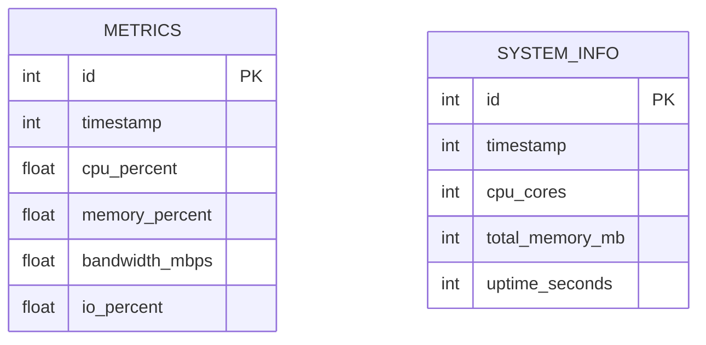

## 1. 架构设计

```mermaid
graph TD
    A[用户浏览器] --> B[React前端应用]
    B --> C[HTTP API请求]
    C --> D[C语言后端服务]
    D --> E[SQLite数据库]
    D --> F[/proc文件系统]
    
    subgraph "前端层"
        B
    end
    
    subgraph "后端服务层"
        D
    end
    
    subgraph "数据存储层"
        E
    end
    
    subgraph "系统数据源"
        F
    end
```

## 2. 技术描述

- **前端**: React@18 + tailwindcss@3 + vite + chart.js
- **初始化工具**: vite-init
- **后端**: C语言 + libmicrohttpd (HTTP服务器) + SQLite3
- **数据库**: SQLite3 (本地文件存储)

## 3. 路由定义

| 路由 | 用途 |
|------|------|
| / | 监控仪表板主页，显示四个指标的实时图表 |
| /settings | 设置页面，配置采样间隔和数据保留策略 |

## 4. API定义

### 4.1 核心API

**获取系统监控数据**
```
GET /api/metrics
```

请求参数：
| 参数名 | 参数类型 | 是否必需 | 描述 |
|--------|----------|----------|------|
| metric | string | false | 指标类型(cpu/memory/bandwidth/io)，不传则返回所有 |
| span | string | false | 时间跨度(30d/7d/1d/1h/1m/realtime)，默认realtime |
| limit | integer | false | 返回数据点数量限制，默认1000 |

响应：
| 参数名 | 参数类型 | 描述 |
|--------|----------|------|
| timestamp | array | 时间戳数组 |
| cpu | array | CPU使用率数组(百分比) |
| memory | array | 内存使用率数组(百分比) |
| bandwidth | array | 带宽使用率数组(Mbps) |
| io | array | IO使用率数组(百分比) |

示例：
```json
{
  "timestamp": [1705660800, 1705660801, 1705660802],
  "cpu": [45.2, 46.1, 44.8],
  "memory": [62.5, 63.1, 61.9],
  "bandwidth": [125.3, 128.7, 122.1],
  "io": [23.4, 25.2, 22.8]
}
```

**获取当前系统状态**
```
GET /api/status
```

响应：
| 参数名 | 参数类型 | 描述 |
|--------|----------|------|
| status | string | 服务状态(ok/error) |
| last_update | integer | 最后更新时间戳 |
| data_points | integer | 数据库中数据点总数 |

### 4.2 数据类型定义

```typescript
interface MetricData {
  timestamp: number[];
  cpu: number[];
  memory: number[];
  bandwidth: number[];
  io: number[];
}

interface SystemStatus {
  status: 'ok' | 'error';
  last_update: number;
  data_points: number;
}

interface TimeSpan = '30d' | '7d' | '1d' | '1h' | '1m' | 'realtime';
```

## 5. 服务器架构图

```mermaid
graph TD
    A[客户端请求] --> B[HTTP路由处理]
    B --> C[数据查询服务]
    C --> D[SQLite数据库]
    
    E[数据采集模块] --> F[/proc解析]
    E --> G[数据存储服务]
    G --> D
    
    H[定时任务] --> E
    
    subgraph "C后端服务"
        B
        C
        E
        G
        H
    end
    
    subgraph "数据层"
        D
    end
    
    subgraph "系统层"
        F
    end
```

## 6. 数据模型

### 6.1 数据模型定义



### 6.2 数据定义语言

**指标数据表 (metrics)**
```sql
-- 创建表
CREATE TABLE metrics (
    id INTEGER PRIMARY KEY AUTOINCREMENT,
    timestamp INTEGER NOT NULL,
    cpu_percent REAL NOT NULL,
    memory_percent REAL NOT NULL,
    bandwidth_mbps REAL NOT NULL,
    io_percent REAL NOT NULL
);

-- 创建索引
CREATE INDEX idx_metrics_timestamp ON metrics(timestamp);
CREATE INDEX idx_metrics_timestamp_desc ON metrics(timestamp DESC);

-- 初始数据（示例）
INSERT INTO metrics (timestamp, cpu_percent, memory_percent, bandwidth_mbps, io_percent) 
VALUES (1705660800, 45.2, 62.5, 125.3, 23.4);
```

**系统信息表 (system_info)**
```sql
-- 创建表
CREATE TABLE system_info (
    id INTEGER PRIMARY KEY AUTOINCREMENT,
    timestamp INTEGER NOT NULL,
    cpu_cores INTEGER NOT NULL,
    total_memory_mb INTEGER NOT NULL,
    uptime_seconds INTEGER NOT NULL
);

-- 创建索引
CREATE INDEX idx_system_info_timestamp ON system_info(timestamp);
```

**数据清理存储过程**
```sql
-- 创建清理旧数据的函数
CREATE FUNCTION cleanup_old_metrics(retention_days INTEGER)
RETURNS void AS $$
BEGIN
    DELETE FROM metrics 
    WHERE timestamp < strftime('%s', 'now', '-' || retention_days || ' days');
END;
$$ LANGUAGE plpgsql;
```